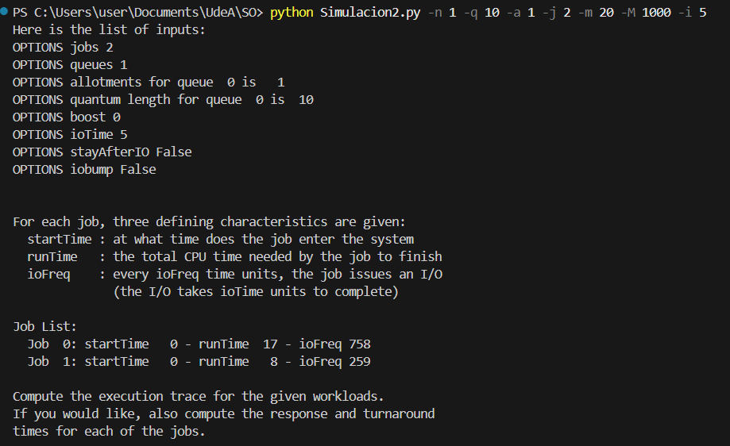
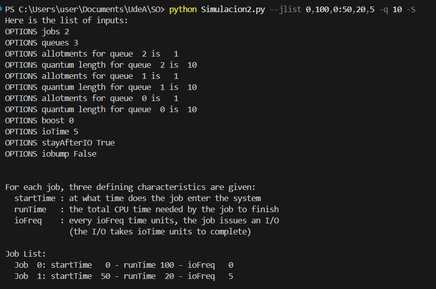
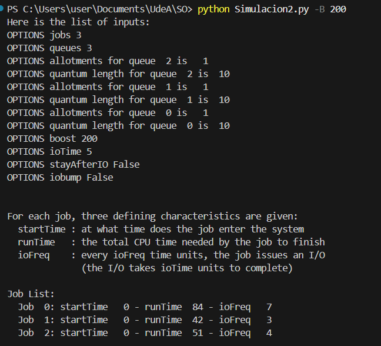
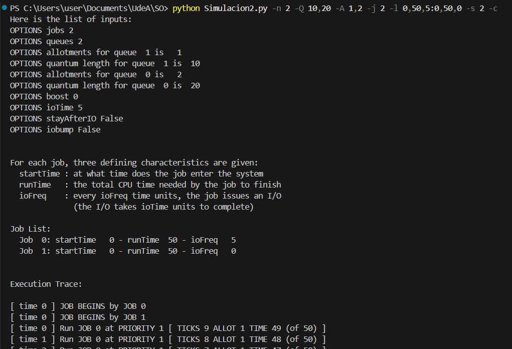
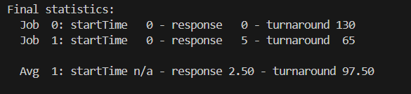
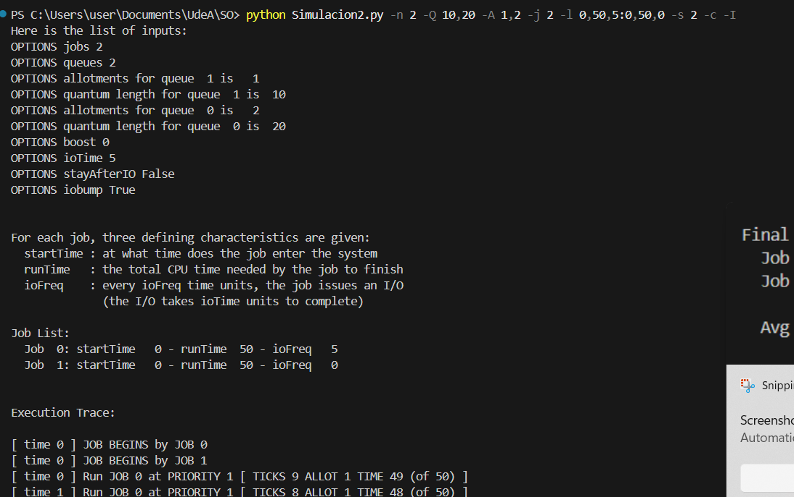
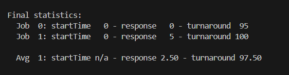

# Actividad de seguimiento - Simulación 2

|Integrante|correo|usuario github|
|---|---|---|
|Juan Diego Calderon Bermeo|juand.calderon@udea.edu.co|juandcalderon16|
|Ana Maria Vega Angarita|ana.vega@udea.edu.co|anavegaa|

## Instrucciones

Antes de empezar a realizar esta actividad haga un **fork** de este repositorio y sobre este trabaje en la solución de las preguntas planteadas en la actividad de simulación. Las respuestas deben ser respondidas en español o si lo prefiere en ingles en el lugar señalado para ello (La palabra **answer** muestra donde).

## Homework (Simulation)

This program, [mlfq.py](mlfq.py), allows you to see how the MLFQ scheduler presented in this chapter behaves. See the [README](https://github.com/remzi-arpacidusseau/ostep-homework/blob/master/cpu-sched-mlfq/README.md) for details.

### Questions

1. Run a few randomly-generated problems with just two jobs and two queues; compute the MLFQ execution trace for each. Make your life easier by limiting the length of each job and turning off I/Os.

2. How would you run the scheduler to reproduce each of the examples in the chapter?
✅ El comando ejecutado con dos colas de prioridad. Ambas colas tienen un quantum de 10 unidades de tiempo, y los trabajos pueden permanecer 1 quantum en cada cola antes de ser degradados automáticamente. Se ejecutan dos trabajos generados aleatoriamente, sin operaciones de entrada/salida (I/O), y cada trabajo tiene una duración máxima de 5 unidades de tiempo.
El Job 0 tuvo prioridad por ser primero en la cola y terminó rápidamente.

El Job 1 tuvo que esperar 1 unidad, pero se ejecutó de corrido porque no hubo competencia ni I/O.

El quantum de 10 fue más que suficiente, ya que ningún trabajo necesitó tanto tiempo seguido.

4. How would you configure the scheduler parameters to behave just like a round-robin scheduler?

   Para configurar el simulador de MLFQ para que se comporte como
 un planificador Round-Robin, debemos asegurarnos de que todos los trabajos 
tengan el mismo nivel de prioridad, que el tiempo de quantum sea el mismo para todas las colas, y que no 
haya ningún tipo de boost que altere las prioridades.

   `./mlfq.py -n 1 -q 10 -a 1 -j 2 -m 20 -M 1000 -i 5 -c`

   Este comando ejecuta una simulación con un solo trabajo (de tipo Round-Robin) que tiene un quantum de 10 unidades de tiempo y una asignación de 1 rebanada de tiempo por cola. Se generarán dos trabajos, cada uno con un máximo de 20 unidades de tiempo de tiempo de ejecución y una frecuencia de I/O muy baja (1000 unidades de tiempo). Además, las solicitudes de I/O tomarán 5 unidades de tiempo cada una.

   

5. Craft a workload with two jobs and scheduler parameters so that one job takes advantage of the older Rules 4a and 4b (turned on
with the -S flag) to game the scheduler and obtain 99% of the CPU over a particular time interval.

   Este comando configura una situación donde el Trabajo 2 (que hace I/O) se beneficia de las Reglas 4a y 4b y obtiene el 99% de la CPU al regresar continuamente a su mismo nivel de prioridad con su allotment intacto, mientras que el Trabajo 1 (sin I/O) utiliza menos CPU debido a que no puede aprovechar estas reglas y su tiempo de ejecución es interrumpido por el otro trabajo.

   `./mlfq.py --jlist 0,100,0:50,20,5 -q 10 -S`

   

7. Given a system with a quantum length of 10 ms in its highest queue, how often would you have to boost jobs back to the highest priority level (with the `-B` flag) in order to guarantee that a single longrunning (and potentially-starving) job gets at least 5% of the CPU?

   Para garantizar que el trabajo largo obtenga al menos 5% de la CPU, el boosting debe ocurrir con una frecuencia que permita que el trabajo largo tenga al menos 10 ms (1 quantum) de CPU al menos 5% del tiempo.

   Dado que el quantum es de 10 ms, y queremos que el trabajo obtenga al menos 5% del tiempo, se requiere que en cada intervalo de 20 unidades de tiempo (de 10 ms), el trabajo largo obtenga al menos 1 quantum (10 ms) de tiempo de CPU.

   Por lo tanto, el boosting debe ocurrir cada 200 ms (porque 20×10ms=200ms ) para garantizar que el trabajo largo obtenga al menos el 5% de la CPU.
   `./mlfq.py -B 200 -c`

   

9. One question that arises in scheduling is which end of a queue to add a job that just finished I/O; the -I flag changes this behavior
for this scheduling simulator. Play around with some workloads and see if you can see the effect of this flag.

   en las imagenes observamos que el tiempo con -I es menor usando el siguiente comando 

   `python mlfq.py -n 2 -Q 10,20 -A 1,2 -j 2 -l 0,50,5:0,50,0 -s 2 -c -I`
   1. Sin -I
   
   
   2. Con -I
   
   

   Podemos observar que puede tener un impacto significativo en el tiempo de respuesta y el rendimiento general del sistema al agregar -I. Los resultados experimentales sugieren que insertar al principio de la cola (-I) puede llevar a tiempos de finalización más rápidos en ciertos escenarios.

   

## Conclusions

estos ejercicios demuestran la flexibilidad del planificador MLFQ y cómo diferentes parámetros y políticas pueden influir drásticamente en el comportamiento del sistema en términos de equidad, rendimiento y capacidad de respuesta. También resaltan la importancia de comprender las posibles interacciones entre las características del planificador y las características de las cargas de trabajo.

### Criterios de evaluación
- [x] Despligue de los resultados y analisis claro de los resultados respecto a lo visto en la teoria.
- [x] Creatividad y orden.
- [x] Sección con las conclusiones de los experimentos realizados.
